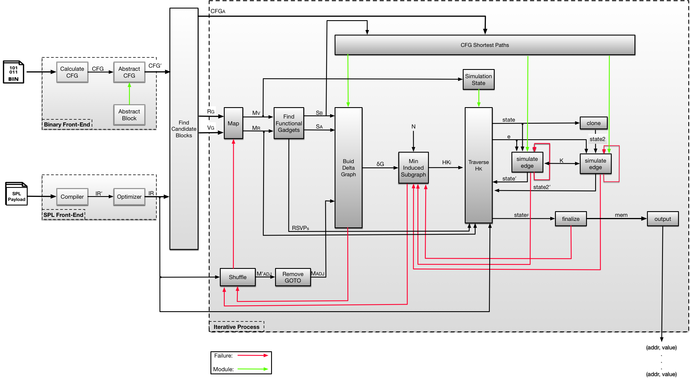

# Block Oriented Programming Compiler (BOPC)

___


### What is BOPC

BOPC (stands for _BOP Compiler_) is a tool for automatically synthesizing arbitrary,
Turing-complete, _Data-Only_ payloads. BOPC finds execution traces in the binary that
execute the desired payload while adhering to the binary's Control Flow Graph (CFG).
This implies that the existing control flow hijacking defenses are not sufficient to
detect this style of execution, as execution does never violates the Control Flow
Integrity (CFI).

Essentially, we can say that Block Oriented Programming is _code reuse under CFI_. 

BOPC works with basic blocks (hence the name "block-oriented"). What it does is to find
a set of _functional_ blocks (i.e., blocks that perform useful computations). This step
is somewhat similar with finding Return Oriented Programming (ROP) gadgets.
Having the functional blocks, BOPC looks for _dispatcher_ blocks to that are used to
stitch functional blocks together. Compared to ROP (that we can move from one gadget
to the next without any limitation), here we can't do that as it would violate the CFI.
Instead, BOPC finds a proper sequence for dispatcher blocks that naturally lead the
execution from one functional block to the next one.
Unfortunately the problem of building _Data-Only_ payloads is NP-hard. 
However it turns out that in practice BOPC finds solution in a reasonable amount
of time.
For more details on how BOPC works, please refer to our [paper](./ccs18_paper.pdf).


To operate, BOPC requires 3 inputs:
* A target binary that has an _Arbitrary Memory Write_ (AWP) vulnerability (**hard requirement**)
* The desired payload, expressed in a high level language called SPL (stands for _SPloit Language)
* The so-called "_entry point_", which is the first instruction in the binary that the
payload execution should start. There can be more than one entry points and determining it is
part of the vulnerability discovery process.


The output of BOPC is a set of "what-where" memory writes that indicate how the memory 
should be initialized (i.e., what values to write at which memory addresses). 
When the execution reaches the entry point and the memory is initialized according to
the output of BOPC, the target binary execute the desired payload instead of continuing
the original execution.


**Disclaimer:** This is a research project coded by a single guy. It's not a product,
so do **not** expect it to work perfectly under all scenarios. It works nicely for the
 provided test cases, but beyond that we cannot guarantee that will work as expected.


### Installation
Just run `setup.sh` :)


### How to use BOPC

BOPC started as a hacky project, so several changes made to adapt it into an scientific
context. That is, the implementation in the [paper](./ccs18_paper.pdf) is slightly
different from the actual implementation, as we omitted several implementation details
from the paper.

The actual implementation overview is shown below:



First, let's start with the command line options:
```
usage: BOPC.py [-h] [-b BINARY] [-a {save,load,saveonly}] [--emit-IR] [-d]
               [-dd] [-ddd] [-dddd] [-V] [-s SOURCE] [-e ENTRY]
               [-O {none,ooo,rewrite,full}] [-f {raw,idc,gdb}] [--find-all]
               [--mapping-id ID] [--mapping MAP [MAP ...]] [--enum-mappings]
               [--abstract-blk BLKADDR] [-c OPTIONS [OPTIONS ...]]

optional arguments:
  -h, --help            show this help message and exit

General Arguments:
  -b BINARY, --binary BINARY
                        Binary file of the target application
  -a {save,load,saveonly}, --abstractions {save,load,saveonly}
                        Work with abstraction file
  --emit-IR             Dump SPL IR to a file and exit
  -d                    Set debugging level to minimum
  -dd                   Set debugging level to basic (recommended)
  -ddd                  Set debugging level to verbose (DEBUG ONLY)
  -dddd                 Set debugging level to print-everything (DEBUG ONLY)
  -V, --version         show program's version number and exit

Search Options:
  -s SOURCE, --source SOURCE
                        Source file with SPL payload
  -e ENTRY, --entry ENTRY
                        The entry point in the binary that payload starts
  -O {none,ooo,rewrite,full}, --optimizer {none,ooo,rewrite,full}
                        Use the SPL optimizer (Default: none)
  -f {raw,idc,gdb}, --format {raw,idc,gdb}
                        The format of the solution (Default: raw)
  --find-all            Find all the solutions

Application Capability:
  -c OPTIONS [OPTIONS ...], --capability OPTIONS [OPTIONS ...]
                        Measure application's capability. Options (can be many)
                        
                        all	Search for all Statements
                        regset	Search for Register Assignments
                        regmod	Search for Register Modifications
                        memrd	Search for Memory Reads
                        memwr	Search for Memory Writes
                        call	Search for Function/System Calls
                        cond	Search for Conditional Jumps
                        load	Load capabilities from file
                        save	Save capabilities to file
                        noedge	Dump statements and exit (don't calculate edges)

Debugging Options:
  --mapping-id ID       Run the Trace Searching algorithm on a given mapping ID
  --mapping MAP [MAP ...]
                        Run the Trace Searching algorithm on a given register mapping
  --enum-mappings       Enumerate all possible mappings and exit
  --abstract-blk BLKADDR
                        Abstract a specific basic block and exit
```


### Notes (read them carefully!)

* When the symbolic execution engine deals with filesystem (i.e., it has to `open` a file),
we have to provide it a valid file. Filename is defined in `SYMBOLIC_FILENAME` in 
[coreutils.py](./source/coreutils.py).

* If you want to visualize things, just uncomment the code in search.py. I'm too lazy to add
CLI flags to trigger it :P

* In case that addresses used by concolic execution do not work, adjust them from 
[simulate.py](./source/simulate.py)

* Make sure that `$rsp` is consistent in `dump()` in [simulate.py](./source/simulate.py)

* For any questions/concerns regarding the code, you can contact [ispo](https://github.com/ispoleet)

___

